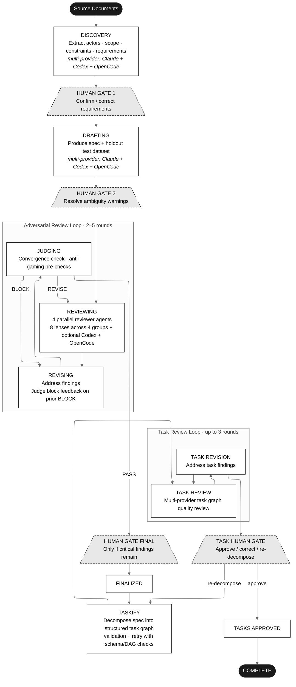
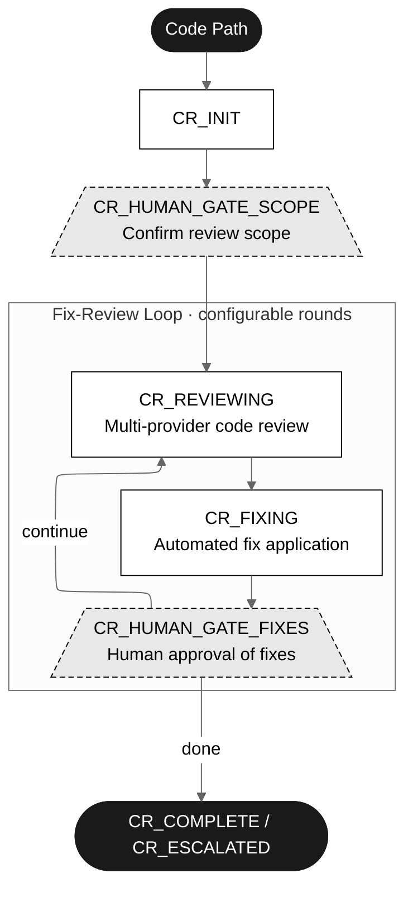
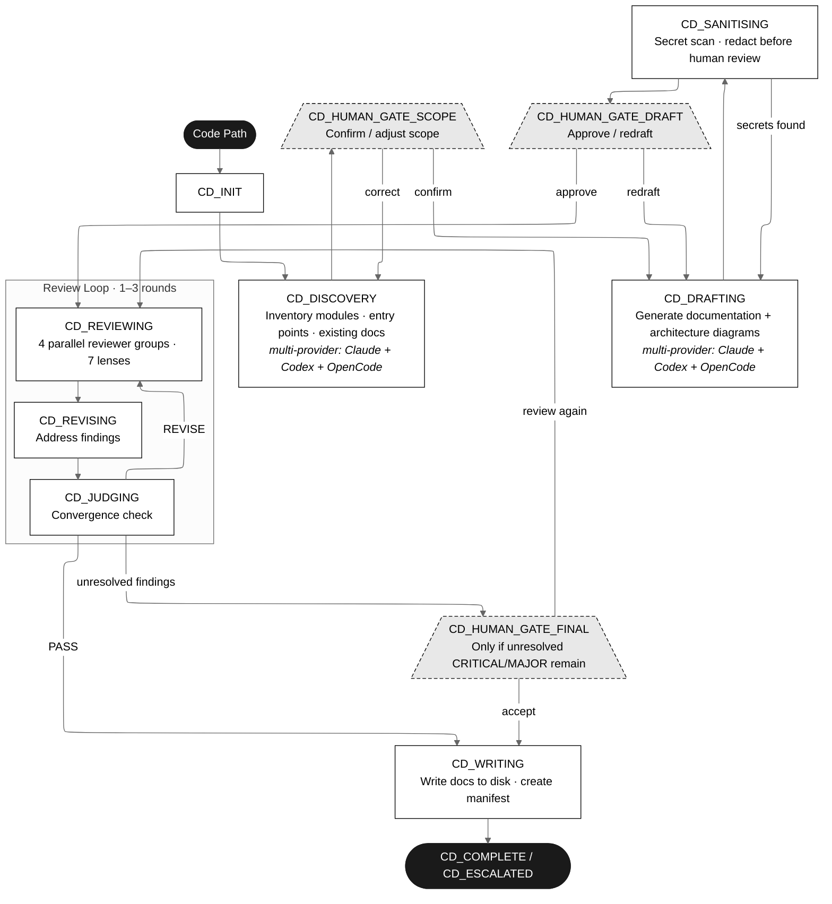

# Adversarial Spec System

> **Note**: This project is under active development. APIs, configuration fields, and workflow behaviour may change between commits.


A multi-agent system that produces high-quality software specifications through adversarial review. Specialised AI agents collaborate and compete — discovering requirements, drafting specs, reviewing through multiple lenses, revising, judging convergence, and decomposing into task graphs — while human gates ensure alignment at critical decision points.

The system supports **multi-provider execution** across discovery, drafting, and review phases, with intelligent merging of outputs. Three provider backends are supported — Claude CLI, Codex CLI, and OpenCode CLI — any combination can be used. OpenCode alone gives access to 75+ LLM providers (Gemini, DeepSeek, Groq, local models, etc.) A separate **code review workflow** provides automated code auditing with fix-review loops. A **code documentation workflow** auto-generates and maintains code documentation.

## How It Works

### Spec Workflow



The dashboard displays this as a visual pipeline stepper showing all stages, with completed stages in green, the current stage pulsing, and future stages grayed out.

### Smart Discovery Restart

When rewinding to the discovery phase, the system detects existing artefacts and offers three choices:

- **Skip to gate** — jump directly to HUMAN_GATE_1 with the existing merged output
- **Replay merge** — re-run the merge step from existing per-provider outputs without re-dispatching agents
- **Restart fresh** — re-run discovery agents from scratch

### Code Review Workflow

A separate workflow for automated code auditing:



### Code Documentation Workflow

A workflow for auto-generating and maintaining code documentation:



Supports **full** and **incremental** modes. Incremental mode reads the `.codedoc-manifest.json` from the previous run and only re-processes changed modules. The writer creates/updates this manifest on completion, enabling efficient subsequent runs.

### Agents

| Agent | Role | Lenses |
|-------|------|--------|
| Discovery | Extracts requirements from source documents | -- |
| Discovery Merge | Intelligently merges multi-provider discovery outputs | -- |
| Drafter | Produces specification and holdout test data | -- |
| Drafter Combine | Merges multi-provider drafter outputs | -- |
| Reviewer (Clarity) | Ambiguity, Incompleteness | AMB, INC |
| Reviewer (Consistency) | Consistency, Feasibility | CON, FEA |
| Reviewer (Security) | Security, Operability | SEC, OPS |
| Reviewer (Correctness) | Correctness, Complexity | COR, CPX |
| Reviser | Addresses findings from reviewers | -- |
| Judge | Evaluates convergence, renders PASS/REVISE/BLOCK verdict | -- |
| Taskify | Decomposes finalized spec into structured task graph | -- |
| Task Reviewer | Reviews task graph for quality and completeness | -- |
| Task Reviser | Addresses task review findings | -- |
| Codedoc Discovery | Inventories modules, entry points, dependencies, existing docs | -- |
| Codedoc Discovery Merge | Merges multi-provider codedoc discovery outputs | -- |
| Codedoc Drafter | Generates documentation and architecture diagrams | -- |
| Codedoc Drafter Combine | Merges multi-provider codedoc drafter outputs | -- |
| Codedoc Reviewer (Accuracy) | Accuracy, Currency | ACC, CUR |
| Codedoc Reviewer (Completeness) | Completeness, Clarity | CMP, CLA |
| Codedoc Reviewer (Architecture) | Architecture, Structure | ARC, STR |
| Codedoc Reviewer (Audit) | Audit, Consistency, Secrets | AUD, CON, SEC |
| Codedoc Reviser | Addresses findings from codedoc reviewers | -- |
| Codedoc Judge | Evaluates convergence, renders PASS/REVISE/BLOCK verdict | -- |
| Codedoc Writer | Writes approved documentation to disk, creates manifest | -- |

All JSON-producing agents use a **validation+retry loop** via `outvalid`: agents are instructed to draft JSON output, run `bin/outvalid --schema workflow-templates/<workflow>/<agent>-output.schema.json --input <draft> --writeTo <dest>`, read the numbered errors, fix the draft, and retry. If the agent cannot produce a valid document within `max_retries` attempts, validation errors are fed back into the orchestrator prompt and the agent is re-dispatched. Schema files for all agent roles live under `workflow-templates/`.

### Judge Verdicts

| Verdict | Meaning | What happens |
|---------|---------|-------------|
| `PASS` | All findings adequately addressed | Proceeds to FINALIZED |
| `REVISE` | Minor issues remain | Returns to REVIEWING |
| `BLOCK` | Reviser under-delivered; critical findings not addressed | Returns to REVISING with the judge's full rationale as feedback |

A `BLOCK` does **not** escalate. The reviser receives the judge's output file and must address every flagged finding before the next judging round.

### Convergence Protocol

The judge's PASS verdict is subject to deterministic anti-gaming checks:

- All CRITICAL findings must be closed or dismissed
- Revision change logs must reference every CRITICAL and MAJOR finding
- Minimum round count must be met
- Authority limits per round: max 2 severity downgrades, max 3 dismissals
- Cumulative escalation: total downgrades + dismissals > 5 triggers escalation

### Circuit Breakers

The workflow halts automatically when any limit is exceeded:

- **Max rounds** -- round count exceeds configured maximum (default: 5)
- **Max findings** -- cumulative finding count exceeds threshold (default: 60)
- **Staleness** -- CRITICAL/MAJOR findings stuck for N consecutive rounds (default: 2)
- **Wall clock** -- elapsed time exceeds budget (default: 60 minutes)
- **Cost** -- cumulative API cost exceeds budget (default: $50)

---

## Quick Start

### Prerequisites

The only manual prerequisite is Claude CLI:

| Dependency | Required | Install |
|------------|----------|---------|
| **Claude CLI** | Yes — primary agent backend | [claude.ai/install.sh](https://claude.ai/install.sh) |
| **Codex CLI** | No — optional second provider | [github.com/openai/codex](https://github.com/openai/codex) |
| **OpenCode CLI** | No — optional provider (75+ LLMs) | [github.com/anomalyco/opencode](https://github.com/anomalyco/opencode) |

At minimum you need Claude CLI. Add Codex and/or OpenCode for multi-provider diversity — each adds a parallel set of agents that independently analyse the same inputs.

```bash
# Verify Claude is installed and authenticated
claude --version
claude auth login   # if not already done
```

The installer handles everything else: server binary, `bd`, `taskval`, `jq`, `check-jsonschema`, and skills.

### Install

```bash
curl -fsSL https://raw.githubusercontent.com/nixlim/spec_system/main/install.sh | bash
```

The script:
- Downloads a pre-built binary (no Go required), or builds from source if Go is available
- Installs **bd** (Beads issue tracking) and **taskval** (task graph validation)
- Installs **jq** and **check-jsonschema** (required by `outvalid` for agent output validation)
- Copies the bundled `plan-spec`, `grill-spec`, and `outvalid` skills to `~/.claude/skills/`
- Writes a default `config.yaml` and creates the workspace directory

```bash
# Options
./install.sh --help                 # All flags
./install.sh --skip-beads           # Skip bd installation
./install.sh --skip-taskval         # Skip taskval installation
./install.sh --skip-outvalid-deps   # Skip jq + check-jsonschema installation
./install.sh --dir ~/bin            # Custom binary location
./install.sh --dry-run              # Preview without making changes
```

If `bd` or `taskval` are not on your PATH, those features are silently disabled and the workflow continues without them.

> **Note**: `outvalid` (`bin/outvalid`) is a bash script in the repo. Add `bin/` to your PATH or invoke it as `./bin/outvalid`.

### Build

```bash
go build -o specworkflow ./cmd/specworkflow
```

### Run

```bash
./specworkflow --config config.yaml --workspace ./workspace
```

Open `http://localhost:8080` for the dashboard.

### CLI Flags

| Flag | Default | Description |
|------|---------|-------------|
| `--port` | `8080` | HTTP listen port |
| `--workspace` | `./workspace` | Directory for spec files, uploads, and metrics |
| `--config` | *(none)* | Path to YAML configuration file |
| `--otel-port` | `4317` | gRPC OTLP receiver port for Claude Code telemetry (0 to disable) |

---

## Configuration

### Skill Directories

The system requires two Claude skill directories containing the templates that govern spec structure and review criteria:

**plan-spec** must contain:
- `spec-template.md` — Specification format and section structure
- `bdd-template.md` — BDD scenario format
- `test-dataset-template.md` — Test dataset format

**grill-spec** must contain:
- `review-constitution.md` — Review lenses and scoring criteria
- `report-template.md` — Report format for the judge

The server searches for skills in these locations in order:
1. Path given in `config.yaml` under `skill_paths`
2. `~/.claude/skills/`
3. `~/.codex/skills/`
4. `.claude/skills/` (relative to working directory)
5. `.agents/skills/`

### config.yaml Reference

Create a `config.yaml` in your working directory. All fields are optional — sensible defaults apply.

```yaml
# ─────────────────────────────────────────────
# Skill paths (required if not auto-discovered)
# ─────────────────────────────────────────────
skill_paths:
  plan_spec: "/path/to/.claude/skills/plan-spec"
  grill_spec: "/path/to/.claude/skills/grill-spec"

# ─────────────────────────────────────────────
# Review loop limits
# ─────────────────────────────────────────────
max_rounds: 5              # Maximum review/revise/judge iterations (default: 5)
min_rounds: 2              # Minimum iterations required before PASS is accepted (default: 2)
max_total_findings: 60     # Cumulative findings before escalation (default: 60)
staleness_threshold: 2     # Consecutive rounds with no CRIT/MAJ progress before halt (default: 2)

# ─────────────────────────────────────────────
# Budget limits
# ─────────────────────────────────────────────
max_wall_clock_minutes: 60  # Elapsed time budget per workflow (default: 60)
max_cost_usd: 50.0          # API cost budget per workflow (default: 50.0)

# ─────────────────────────────────────────────
# Human gate configuration
# ─────────────────────────────────────────────
max_gate_corrections: 3    # Max correction rounds at Gate 1 (post-discovery) (default: 3)
max_gate2_redrafts: 1      # Max redraft rounds at Gate 2 (post-draft) (default: 1)

# ─────────────────────────────────────────────
# Agent reliability
# ─────────────────────────────────────────────
max_retries: 2             # Retry attempts per agent on validation failure (default: 2)

# ─────────────────────────────────────────────
# Agent timeouts (seconds)
# ─────────────────────────────────────────────
agent_timeout_seconds: 300      # Discovery, drafting, taskify agents (default: 300)
reviewer_timeout_seconds: 300   # Reviewer agents — all providers (default: 300)
holdout_timeout_seconds: 300    # Holdout generation agents (default: 300)

# ─────────────────────────────────────────────
# Model selection
# ─────────────────────────────────────────────
# Empty string means the Claude CLI picks its default model.
# Set per-role to use different models for different tasks.
claude_models:
  default: ""              # Fallback for any role not explicitly set
  reviewer: ""             # All 4 reviewer agents
  holdout: ""              # Holdout generation agents
  reviser: ""              # Reviser agent
  judge: ""                # Judge agent
  discovery: ""            # Discovery agent
  drafter: ""              # Drafter agent
  taskify: ""              # Taskify agent
  task_reviewer: ""        # Task reviewer agent
  task_reviser: ""         # Task reviser agent

# ─────────────────────────────────────────────
# Multi-provider (Codex CLI) — requires codex on PATH
# ─────────────────────────────────────────────
enable_codex_reviewers: true    # Parallel Codex reviewers + holdout (default: true)
enable_codex_discovery: false   # Parallel Codex discovery agent (default: false)
enable_codex_drafting: false    # Parallel Codex drafting agent (default: false)
codex_model: "gpt-5.4"         # Model ID passed to the Codex CLI (default: "gpt-5.4")

# ─────────────────────────────────────────────
# Primary provider selection
# ─────────────────────────────────────────────
# Set to "opencode" to use OpenCode CLI as the primary provider for ALL roles
# instead of Claude CLI. Users without Claude CLI can run the entire workflow
# via OpenCode with any of its 75+ supported LLM backends.
# Valid values: "claude" (default), "opencode"
primary_provider: "claude"

# ─────────────────────────────────────────────
# Multi-provider (OpenCode CLI as secondary) — requires opencode on PATH
# NOTE: enable_opencode_* flags are for running OpenCode as a SECONDARY
# provider alongside Claude. They cannot be used when primary_provider is "opencode".
# ─────────────────────────────────────────────
enable_opencode_reviewers: false  # Parallel OpenCode reviewers + holdout (default: false)
enable_opencode_discovery: false  # Parallel OpenCode discovery agent (default: false)
enable_opencode_drafting: false   # Parallel OpenCode drafting agent (default: false)
opencode_models:
  default: ""                     # provider/model string (e.g. "google/gemini-2.5-pro")
  reviewer: ""                    # Model for reviewer agents
  holdout: ""                     # Model for holdout generation
  reviser: ""                     # Model for spec revision agent
  judge: ""                       # Model for convergence judge
  discovery: ""                   # Model for discovery agent
  drafter: ""                     # Model for drafting agent
  taskify: ""                     # Model for task decomposition
  task_reviewer: ""               # Model for task review
  task_reviser: ""                # Model for task revision

# ─────────────────────────────────────────────
# Task decomposition
# ─────────────────────────────────────────────
taskify_max_retries: 3         # Max validation+retry attempts for task graph (default: 3)
task_review_max_rounds: 3      # Max task review/revision rounds (default: 3)

# ─────────────────────────────────────────────
# Beads issue tracking — requires bd on PATH
# ─────────────────────────────────────────────
# If bd is not installed, these settings have no effect.
beads_gate_poll_interval: 5s   # How often to poll gate task status in Beads (default: 5s)
beads_gate_timeout: 24h        # Advisory warning threshold for gates left open (default: 24h)

# ─────────────────────────────────────────────
# Code review workflow
# ─────────────────────────────────────────────
code_review:
  max_rounds: 3                  # Fix-review iterations (default: 3)
  max_cost_usd: 50.0             # Cost budget (default: 50.0)
  max_wall_clock_minutes: 120    # Time budget (default: 120)
  fixer_timeout_seconds: 600     # Fixer agent timeout (default: 600)
  commit_mode: branch_per_round  # "branch_per_round" or "direct_commit"
  staleness_threshold: 2
  max_retries: 2
  reviewer_timeout_seconds: 300
  claude_models:
    default: ""
    reviewer: ""
    fixer: ""

# ─────────────────────────────────────────────
# Code documentation workflow
# ─────────────────────────────────────────────
codedoc:
  max_rounds: 3                       # Review/revise iterations (default: 3)
  min_rounds: 1                       # Minimum rounds before human gate allowed (default: 1)
  max_cost_usd: 50.0                  # Cost budget (default: 50.0)
  max_wall_clock_minutes: 90          # Time budget (default: 90)
  max_gate_corrections: 3             # Max scope gate correction rounds (default: 3)
  max_gate_draft_redrafts: 2          # Max redraft rounds at draft gate (default: 2)
  staleness_threshold: 2              # Consecutive unchanged rounds before escalation (default: 2)
  agent_timeout_seconds: 600          # General agent timeout (default: 600)
  discovery_timeout_seconds: 1200     # Discovery timeout — larger codebases (default: 1200)
  reviewer_timeout_seconds: 300       # Reviewer agent timeout (default: 300)
  max_retries: 2                      # Retry attempts per agent on failure (default: 2)
  default_mode: full                  # "full" or "incremental" (default: full)
  docs_output_dir: docs               # Output directory for generated docs (default: docs)
  backup_before_write: true           # Create .bak files before overwriting (default: true)
  drift_warning_threshold: 0.20       # Fraction of changed files that triggers a drift warning (default: 0.20)
  enable_codex_codedoc_discovery: false  # Multi-provider discovery (default: false)
  enable_codex_codedoc_drafting: false   # Multi-provider drafting (default: false)
  enable_codex_reviewers: true           # Multi-provider reviewers (default: true)
  claude_models:
    default: ""
    discovery: ""
    drafter: ""
    reviewer: ""
    judge: ""
```

### Minimal Config (Fastest Start)

```yaml
skill_paths:
  plan_spec: "~/.claude/skills/plan-spec"
  grill_spec: "~/.claude/skills/grill-spec"
```

Everything else uses defaults. This gets you Claude + Codex reviewing with sensible round limits and budgets. Set `enable_codex_reviewers: false` for Claude-only mode.

---

## Dashboard

The web dashboard provides real-time visibility into workflow execution. Multiple workflows can run concurrently, each tracked independently.

### Tabs

- **Controls** — Active workflow list, start new workflows (spec, code review, codedoc), upload source documents, assign documents to workflows, manage workspace
- **Running Agents** — Live table of all agent subprocesses (Feature, Role, PID, Start Time, Status); real-time updates via WebSocket; Kill button sends SIGTERM → SIGKILL
- **Spec** — View and diff spec versions as they evolve through rounds
- **Issues** — Track findings with severity/status/lens filtering; shows round raised and round closed for each finding
- **Convergence** — Monitor review/revision convergence metrics and round history
- **Workspace Files** — Browse all files in a workflow's workspace directory; download individual files or view raw content
- **Messages** — Filtered workflow log (OTEL, Orchestrator, Claude Runner, Agent Events, State Transitions)

### Workflow Status Panel

A persistent top panel shows aggregate metrics updated in real-time via WebSocket:

- **Pipeline stepper** — visual chain of all workflow stages with progress indication
- Feature name, round number, workflow state badge, workflow type badge (SPEC/CR)
- Cost (from OTEL telemetry), elapsed wall clock time
- Token usage (input, output, cache read), API call count, agent cost
- Activity feed of individual tool and API events
- Source document list per workflow

### Human Gates

Gate panels appear when the workflow requires human input:

- **Gate 1** — Review discovery output, answer open questions, provide corrections
- **Gate 2** — Resolve ambiguity warnings (accept/answer/defer per warning)
- **Gate Final** — Approve or reject when critical findings persist
- **Task Gate** — Review task graph, approve or request re-decomposition

### Workflow Rewind and Replay

Workflows can be rewound to any previous stage from the UI. Setting the `state` field in `workflow-state.json` directly is also honoured — the system respects an explicit non-terminal state rather than re-deriving it from artefacts on disk.

Individual phases can be **replayed** without re-dispatching agents:
- **Discovery merge** — re-run the intelligent merge from existing per-provider outputs
- **Drafting combine** — re-run the combine agent from existing per-provider drafts
- **Review merge** — re-run findings dedup from existing reviewer outputs
- **Task review merge** — re-run task findings dedup from existing task reviewer outputs

---

## Beads Integration

When `bd` (Beads) is installed and a `.beads/` workspace exists in the working directory, the system automatically enables issue tracking integration.

### What Gets Tracked

| Item | Beads Artefact | Content |
|------|---------------|---------|
| Each workflow run | Epic issue | Feature name, run ID, start time |
| Each reviewer finding | Child issue (type: `finding`) | ID, severity, lens, affected section, round, agent |
| Human gate points | Task issue (gate proxy) | Gate name, feature, accept/reject instructions |
| Review round | Molecule | Steps: reviewing → revising → judging |
| State snapshots | KV store | Current state, round, run ID, step IDs |

### Gate Proxies

When the workflow reaches a human gate (Gate 1, Gate 2, Gate Final, Task Gate), it creates a Beads task issue. The orchestrator polls `bd show <id>` every `beads_gate_poll_interval` (default 5s). Close the task with reason `ACCEPT: <comment>` or `REJECT: <comment>` to advance the workflow.

This mirrors the gate panel in the dashboard — both mechanisms work and either one unblocks the workflow.

### Crash Recovery with Beads

If the server restarts mid-workflow, the orchestrator reads the run epic's children from Beads to rebuild the in-memory issue tracker. All finding statuses are restored from Beads state.

### Graceful Degradation

If `bd` is not on your PATH, Beads integration is silently disabled. The message `[orchestrator] Beads integration disabled: bd not found` appears in the server log. The workflow runs identically without it.

---

## API Reference

### Spec Workflow

| Method | Endpoint | Description |
|--------|----------|-------------|
| POST | `/api/workflow/start` | Start new workflow |
| POST | `/api/workflow/cancel` | Cancel running workflow |
| GET | `/api/workflow/status` | Poll workflow status |
| POST | `/api/workflow/resume` | Resume from ESCALATED/ERROR state |
| POST | `/api/workflow/rewind` | Rewind to target state and round |
| POST | `/api/workflow/replay` | Replay a specific phase |
| POST | `/api/workflow/finalize` | Force transition to FINALIZED |
| POST | `/api/workflow/reset` | Delete feature directory |
| POST | `/api/workflow/restart` | Stop, delete, and restart |
| POST | `/api/workflow/retry` | Clear stale state file |
| GET | `/api/workflow/agents` | List active agents |

### Code Review

| Method | Endpoint | Description |
|--------|----------|-------------|
| POST | `/api/codereview/start` | Start new code review |
| GET | `/api/codereview/{feature}/status` | Poll code review status |
| POST | `/api/codereview/{feature}/gate` | Submit gate decision |
| POST | `/api/codereview/{feature}/cancel` | Cancel running code review |
| POST | `/api/codereview/{feature}/resume` | Resume from ERROR state |
| POST | `/api/codereview/{feature}/reset` | Delete code review feature directory |

### Code Documentation

| Method | Endpoint | Description |
|--------|----------|-------------|
| POST | `/api/codedoc/start` | Start new codedoc workflow |
| GET | `/api/codedoc/{feature}/status` | Poll codedoc status |
| POST | `/api/codedoc/{feature}/gate` | Submit gate decision |
| POST | `/api/codedoc/{feature}/cancel` | Cancel running codedoc workflow |
| POST | `/api/codedoc/{feature}/resume` | Resume from ERROR state |
| POST | `/api/codedoc/{feature}/reset` | Delete codedoc feature directory |

### Source Documents

| Method | Endpoint | Description |
|--------|----------|-------------|
| POST | `/api/upload` | Upload documents to global library |
| GET | `/api/uploads` | List uploaded files |
| POST | `/api/workflow/{feature}/source-docs` | Assign documents to a workflow |
| GET | `/api/workflow/{feature}/source-docs` | List assigned documents |

### Gates

| Method | Endpoint | Description |
|--------|----------|-------------|
| POST | `/api/tasks/{id}/approve` | Approve gate (with corrections/resolutions) |
| POST | `/api/tasks/{id}/reject` | Reject gate (cancel workflow) |

### Data Access

| Method | Endpoint | Description |
|--------|----------|-------------|
| GET | `/api/workspace/features` | List all features with metadata |
| GET | `/api/workspace/features/{name}/state` | Feature workflow state |
| GET | `/api/workspace/features/{name}/files/{f}` | Specific feature file |
| GET | `/api/spec/*` | Spec versions, diffs, issues, convergence |
| GET | `/api/metrics` | Persisted OTEL telemetry |
| GET | `/api/messages` | Workflow log messages |
| GET | `/api/logs/server` | Server log ring buffer |
| GET | `/ws` | WebSocket event stream |

---

## Architecture

```
cmd/specworkflow/main.go          CLI entry point, HTTP routing

internal/api/
  workflow_handler.go             HTTP handlers, WorkflowManager
  codereview_handlers.go          Code review HTTP handlers
  codedoc_handlers.go             Code documentation HTTP handlers
  otel_receiver.go                OTLP gRPC receiver for Claude telemetry
  metrics_store.go                SQLite persistence for telemetry
  websocket.go                    WebSocket hub and broadcasting
  spec_endpoints.go               Spec/issue/convergence REST endpoints

internal/specworkflow/
  orchestrator.go                 Main workflow loop and state coordination
  orchestrator_discovery.go       Discovery phase + Gate 1
  orchestrator_drafting.go        Drafting phase + Gate 2
  orchestrator_review.go          Review dispatch + revision + judging
  orchestrator_beads.go           Beads integration: epics, findings, gates, molecules
  orchestrator_taskify.go         Task graph decomposition + validation loop
  orchestrator_task_review.go     Task review/revision loop
  statemachine.go                 State machine with guarded transitions
  claude_runner.go                Claude CLI subprocess execution
  codex_runner.go                 Codex CLI subprocess execution
  opencode_runner.go              OpenCode CLI subprocess execution (JSONL parsing, 75+ providers)
  beads_client.go                 Beads CLI client (BeadsClientInterface + BeadsClient)
  beads_client_mock.go            Mock Beads client for tests
  issues.go                       Issue tracker with lifecycle transitions + ExportLiveState
  prompts.go                      Prompt construction for all agents
  convergence.go                  Anti-gaming pre-checks and convergence
  breakers.go                     Circuit breaker evaluation
  config.go                       Configuration parsing and validation
  types.go                        Core type definitions and workflow states
  recovery.go                     Agent failure detection and retry

bin/
  outvalid                        JSON schema validator for agent output (requires check-jsonschema, jq)

workflow-templates/               JSON Schema files for all agent output types
  specworkflow/                   Spec workflow agent schemas
  codedoc/                        Code documentation agent schemas
  codereview/                     Code review agent schemas

static/
  index.html                      Dashboard HTML
  app.js                          Dashboard JavaScript (SPA)
  style.css                       Dashboard styles
```

---

## Persistence

### Workspace Layout

```
workspace/
  metrics.db                       SQLite telemetry database
  source-docs/                     Uploaded reference documents
  specs/{feature}/
    source-docs/                   Per-workflow document copies
    workflow-state.json            Persisted workflow state (edit to rewind)
    workflow-log.jsonl             Structured workflow log

    # Discovery phase
    discovery-output.json
    discovery-output-claude-v{N}.json
    discovery-output-codex-v{N}.json
    discovery-output-merged-v{N}.json

    # Drafting phase
    spec-v0.md                     Initial draft
    spec-v{N}.md                   Revised spec per round
    {feature}-holdouts.md

    # Review/revise/judge loop
    review-{a,b,c,d}-round-{N}.json
    merged-findings-round-{N}.json   Frozen findings snapshot (all statuses = open)
    issue-tracker-round-{N}.json     Live tracker state (accurate statuses) — used by judge
    revision-round-{N}.json
    judge-round-{N}.json

    # Finalized output
    spec-final.md

  .tasks/
    {feature}.task.json            Structured task graph
```

**Rewinding manually:** Edit `workflow-state.json` and change `"state"` to the desired active state (e.g. `"REVISING"`). The server respects this on resume and will not override it with artefact-based inference.

### Telemetry

OTEL telemetry from Claude Code is persisted to `workspace/metrics.db`:

- Aggregate token/cost counters per feature (upserted on every OTEL update)
- Individual tool invocations and API calls with duration and cost
- 90-day retention with automatic cleanup on startup

---

## Testing

```bash
go test ./...
```

Test coverage includes: state machine, orchestrator, convergence, circuit breakers, issue lifecycle, agent output validation, prompt construction, persistence, recovery, resume, rewind, replay, security, configuration, JSON validation+retry, Beads client and integration, discovery resume, code review state machine, and HTTP/WebSocket handlers.

---

## Development

### Project Structure

- `internal/specworkflow/` — Core spec workflow engine (pure Go, no HTTP dependencies)
- `internal/codereview/` — Code review workflow engine
- `internal/codedoc/` — Code documentation workflow engine
- `internal/api/` — HTTP/WebSocket/gRPC layer
- `cmd/specworkflow/` — CLI entry point
- `static/` — Dashboard frontend (vanilla JS, no build step)

### WebSocket Event Types

`spec_version`, `issue_update`, `convergence_update`, `gate_request`, `gate_response`, `circuit_breaker`, `agent_error`, `state_transition`, `agent_dispatch`, `agent_complete`, `workflow_status`, `agent_metrics`, `agent_tool_event`, `agent_api_event`

---

## License

MIT License — see [LICENSE](LICENSE) for the full text.
